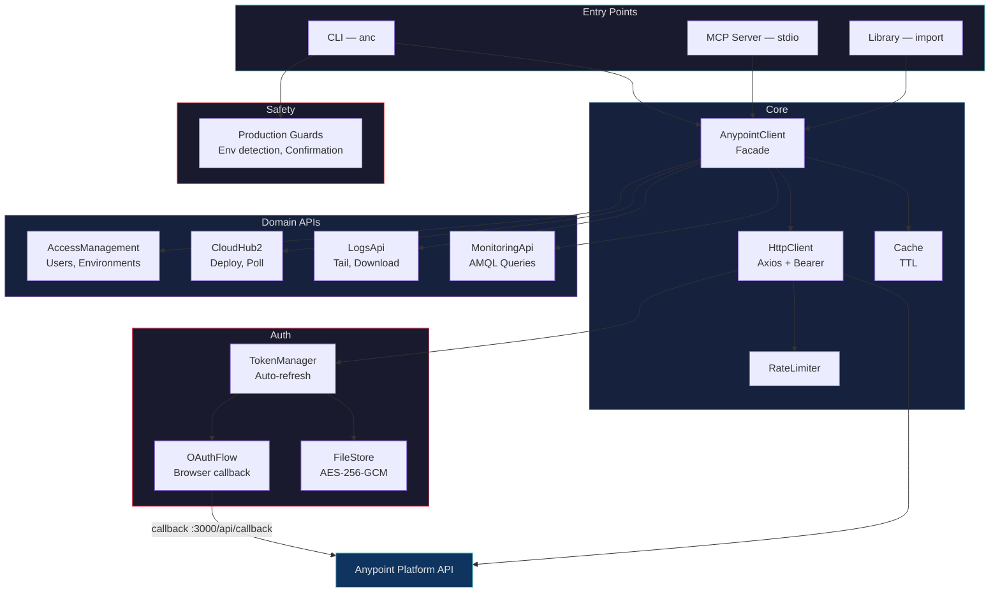
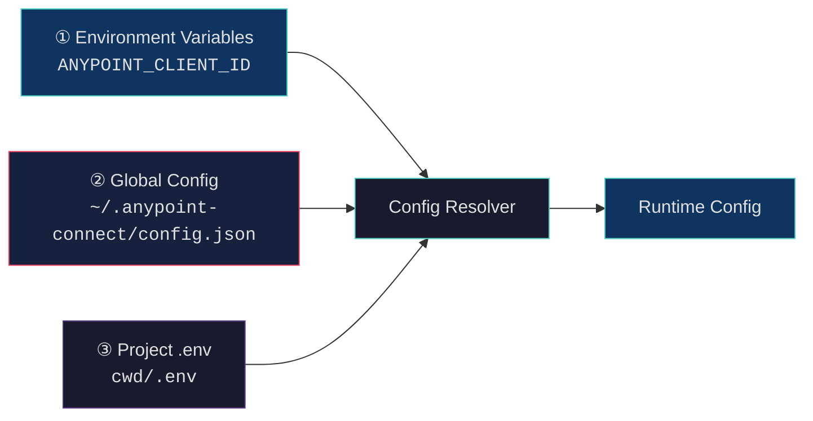

# Anypoint Connect

> CLI + MCP toolkit for Anypoint Platform — deploy, tail logs, pull metrics, with production safety nets.

```
npm install
npm run build
```

---

## Architecture



```
src/
├── auth/              OAuth2 + encrypted token storage
│   ├── OAuthFlow.ts         Browser callback at /api/callback
│   ├── TokenManager.ts      Auto-refresh with 5-min buffer
│   ├── FileStore.ts         AES-256-GCM encrypted tokens
│   └── TokenStore.ts        Storage interface
├── client/            HTTP + facade
│   ├── AnypointClient.ts    Main facade (single entry point)
│   ├── HttpClient.ts        Axios with Bearer injection
│   ├── RateLimiter.ts       Token bucket throttling
│   └── Cache.ts             TTL in-memory cache
├── api/               Domain API clients
│   ├── CloudHub2Api.ts      Deploy, redeploy, delete, poll
│   ├── LogsApi.ts           Search, tail, period download
│   ├── MonitoringApi.ts     AMQL queries, JSON/CSV export
│   └── AccessManagementApi.ts
├── commands/          CLI commands
│   ├── config.ts      init | show | set | path
│   ├── auth.ts        login | logout | status
│   ├── apps.ts        list | status
│   ├── deploy.ts      deploy with prod safety net
│   ├── logs.ts        tail | download
│   └── monitor.ts     view | download
├── safety/            Production guards
│   └── guards.ts      Env detection, JAR validation, confirmation
├── utils/
│   └── config.ts      3-layer config resolution
├── cli.ts             CLI entry point (bin: anc)
├── mcp.ts             MCP server entry point
└── index.ts           Library barrel export
```

### Config Resolution

Credentials and settings are resolved via a 3-layer priority chain:



| Priority | Source | When to use |
|----------|--------|-------------|
| **1 (highest)** | Environment variables | CI/CD pipelines, Docker, per-session overrides |
| **2** | `~/.anypoint-connect/config.json` | Day-to-day development — persists globally |
| **3 (lowest)** | `.env` in current directory | Legacy/project-local fallback |

Everything lives under `~/.anypoint-connect/`:

```
~/.anypoint-connect/
├── config.json     OAuth credentials + settings (chmod 600)
└── tokens.enc      AES-256-GCM encrypted access/refresh tokens
```

---

## Setup

### 1. Clone & Install

```bash
git clone <repo-url> anypoint-connect
cd anypoint-connect
npm install
npm run build
```

### 2. Link CLI globally (optional but recommended)

```bash
npm link
# Now "anc" is available from any directory
```

### Creating a Connected App in Anypoint Platform

Before running `config init`, you need a Connected App (OAuth client) from Anypoint:

1. Log in to [Anypoint Platform](https://anypoint.mulesoft.com)
2. Go to **Access Management → Connected Apps**
3. Click **Create app**
4. Choose type: **App that acts on a user's behalf**
5. Set the **Redirect URI** to:
   ```
   http://localhost:3000/api/callback
   ```
6. Grant at minimum these scopes:
   - `General` → **View Organization**, **View Environment**
   - `Runtime Manager` → **Read Applications**, **Create/Modify Applications** (if deploying)
   - `CloudHub` → **Read Applications**, **Manage Applications** (if deploying)
   - `Monitoring` → **Read Metrics** (if using monitoring)
7. Save the app and copy the **Client ID** and **Client Secret**

Now run the setup wizard with those values:

```bash
anc config init
#
#   Anypoint Connect Setup
#
#   Credentials are saved to ~/.anypoint-connect/config.json (chmod 600)
#   Tokens are saved to ~/.anypoint-connect/tokens.enc (AES-256-GCM)
#
#   Client ID: <paste your Client ID>
#   Client Secret: <paste your Client Secret>
#   Callback URL: (http://localhost:3000/api/callback)
#   Base URL: (https://anypoint.mulesoft.com)
#   Default Environment (optional): Sandbox
#
#   ✔ Configuration saved!
```

### 4. Authenticate

```bash
anc auth login
# Opens browser → OAuth consent → callback → tokens stored
```

That's it. From here, every `anc` command (and the MCP server) picks up your credentials
automatically, no matter which directory you're in.

### Managing Config

```bash
# Show current config (secrets masked)
anc config show

# Update a single value
anc config set defaultEnv Production

# Print config directory path
anc config path
# /Users/you/.anypoint-connect

# Or override per-session with environment variables
ANYPOINT_CLIENT_ID=other-id anc apps list --env Sandbox
```

---

## Authentication

```bash
# Opens browser for OAuth login
anc auth login

# Check who you're logged in as
anc auth status
# ✔ Authenticated
#   User: John Doe (jdoe)
#   Organization: My Org
#   Org ID: abc-123-def

# Clear stored tokens
anc auth logout
```

Tokens auto-refresh using the stored refresh token. No need to re-login unless you explicitly logout.

---

## CLI Usage

### List Applications

```bash
anc apps list --env Sandbox
# ┌─────────────────────┬─────────┬────────┬────────┬──────────┐
# │ Name                │ Status  │ Version│ Runtime│ Replicas │
# ├─────────────────────┼─────────┼────────┼────────┼──────────┤
# │ my-api              │ APPLIED │ 1.2.0  │ 4.8.0  │ 1        │
# │ order-service       │ APPLIED │ 3.1.0  │ 4.7.0  │ 2        │
# └─────────────────────┴─────────┴────────┴────────┴──────────┘

anc apps status my-api --env Sandbox
```

### Deploy

```bash
# Standard deploy
anc deploy target/my-api-1.2.0-mule-application.jar \
  --app my-api \
  --env Sandbox \
  --runtime 4.8.0

# Production deploy — triggers safety confirmation
anc deploy target/my-api-1.2.0-mule-application.jar \
  --app my-api \
  --env Production
#
#   ⚠️  PRODUCTION DEPLOYMENT
#   ════════════════════════════════════
#
#   App:         my-api
#   Environment: Production
#   Current:     v1.1.0 (APPLIED, 2 replicas)
#   New Version: v1.2.0
#
#   Type 'deploy to production' to confirm: _

# Skip confirmation (CI/CD)
anc deploy app.jar --app my-api --env Production --force
```

### Tail Logs

```bash
# Stream logs in real-time (Ctrl+C to stop)
anc logs tail my-api --env Sandbox

# Filter by level
anc logs tail my-api --env Sandbox --level ERROR

# Search in logs
anc logs tail my-api --env Sandbox --search "NullPointerException"
```

### Download Logs

```bash
# Last 24 hours
anc logs download my-api --env Sandbox --from 24h

# Last 7 days, errors only
anc logs download my-api --env Sandbox --from 7d --level ERROR

# Specific date range
anc logs download my-api --env Production \
  --from "2026-02-01T00:00:00Z" \
  --to "2026-02-14T00:00:00Z" \
  --output prod-logs.log
```

### Monitoring Metrics

```bash
# View metrics table (default: last 24h)
anc monitor view --env Sandbox
# ┌─────────────────┬──────────┬──────────────┬────────┬──────────┬──────────────┐
# │ Application     │ Requests │ Avg Response │ Errors │ Outbound │ Outbound Avg │
# ├─────────────────┼──────────┼──────────────┼────────┼──────────┼──────────────┤
# │ my-api          │ 12,450   │ 234ms        │ 12     │ 8,200    │ 180ms        │
# └─────────────────┴──────────┴──────────────┴────────┴──────────┴──────────────┘

# Last 7 days for a specific app
anc monitor view --env Production --app my-api --from 7d

# Export as JSON
anc monitor download --env Production --from 30d --format json

# Export as CSV
anc monitor download --env Sandbox --from 7d --format csv --output metrics.csv
```

---

## MCP Server Setup

The MCP server exposes Anypoint operations as tools for AI assistants.
It reads credentials from the same `~/.anypoint-connect/config.json` — no need to duplicate secrets.

### Prerequisites

```bash
anc config init    # one-time setup
anc auth login     # get tokens
```

### Configuration

Add to your MCP client config (Claude Desktop, Cursor, etc.):

```json
{
  "mcpServers": {
    "anypoint-connect": {
      "command": "node",
      "args": ["/absolute/path/to/anypoint-connect/dist/mcp.js"]
    }
  }
}
```

No `env` block needed — the MCP server reads from `~/.anypoint-connect/` automatically.

### Available MCP Tools

| Tool | Description |
|------|-------------|
| `whoami` | Get authenticated user & org info |
| `list_environments` | List all environments in the org |
| `list_apps` | List deployed apps in an environment |
| `get_app_status` | Detailed deployment status |
| `get_logs` | Fetch recent log entries |
| `download_logs` | Download logs for a time range |
| `get_metrics` | Fetch monitoring metrics (AMQL) |

### Available MCP Prompts

| Prompt | Description |
|--------|-------------|
| `check-app-health` | Composite health check: status + logs + metrics |
| `troubleshoot-app` | Guided troubleshooting with error log analysis |

### MCP Resource

| Resource | URI |
|----------|-----|
| Environments | `anypoint://environments` |

### Example MCP Interactions

Once configured, you can ask your AI assistant things like:

- *"What apps are running in the Sandbox environment?"*
- *"Show me the last 50 error logs for my-api in Production"*
- *"Check the health of order-service in Sandbox"*
- *"What are the metrics for all apps in Production over the last 7 days?"*
- *"Download 24 hours of logs for my-api in Production"*

---

## Programmatic Usage

```typescript
import { AnypointClient } from 'anypoint-connect';

const client = new AnypointClient({
  clientId: process.env.ANYPOINT_CLIENT_ID!,
  clientSecret: process.env.ANYPOINT_CLIENT_SECRET!,
});

// Get user info
const me = await client.whoami();
console.log(me.organization.name);

// List environments
const orgId = me.organization.id;
const envs = await client.accessManagement.getEnvironments(orgId);

// List apps in sandbox
const sandbox = envs.find(e => e.name === 'Sandbox')!;
const apps = await client.cloudHub2.getDeployments(orgId, sandbox.id);

// Tail logs
for await (const entries of client.logs.tailLogs(orgId, sandbox.id, 'my-api')) {
  entries.forEach(e => console.log(`[${e.priority}] ${e.message}`));
}

// Get metrics
const metrics = await client.monitoring.getAppMetrics(
  orgId, sandbox.id,
  Date.now() - 24 * 60 * 60 * 1000, // from: 24h ago
  Date.now()                          // to: now
);
```

---

## License

MIT
