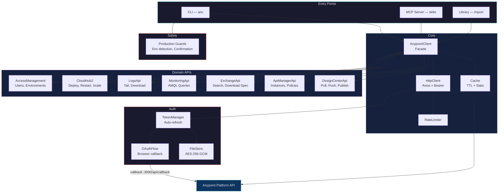
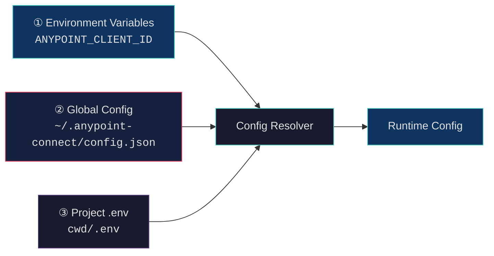

# Anypoint Connect

> CLI + MCP toolkit for Anypoint Platform — deploy, tail logs, pull metrics, manage API specs, with production safety nets.

[](https://github.com/Avinava/anypoint-connect/actions/workflows/ci.yml)
[](https://www.npmjs.com/package/@sfdxy/anypoint-connect)

```bash
npm install -g @sfdxy/anypoint-connect
```

---

## Architecture



```
src/
├── auth/              OAuth2 + encrypted token storage
│   ├── OAuthFlow.ts         Browser callback at /api/callback
│   ├── TokenManager.ts      Auto-refresh with 5-min buffer
│   ├── FileStore.ts         AES-256-GCM encrypted tokens
│   └── TokenStore.ts        Storage interface
├── client/            HTTP + facade
│   ├── AnypointClient.ts    Main facade (single entry point)
│   ├── HttpClient.ts        Axios with Bearer injection
│   ├── RateLimiter.ts       Token bucket throttling
│   └── Cache.ts             TTL in-memory cache with observability
├── api/               Domain API clients
│   ├── CloudHub2Api.ts      Deploy, redeploy, restart, scale, poll
│   ├── LogsApi.ts           Tail, download (CH2 native)
│   ├── MonitoringApi.ts     AMQL queries, JSON/CSV export
│   ├── ExchangeApi.ts       Search assets, download specs
│   ├── ApiManagerApi.ts     API instances, policies, SLA tiers
│   ├── DesignCenterApi.ts   Projects, files, lock/save, publish
│   └── AccessManagementApi.ts
├── commands/          CLI commands
│   ├── config.ts      init | show | set | path
│   ├── auth.ts        login | logout | status
│   ├── apps.ts        list | status | restart | scale
│   ├── deploy.ts      deploy with prod safety net
│   ├── logs.ts        tail | download
│   ├── monitor.ts     view | download
│   ├── exchange.ts    search | info | download-spec
│   ├── api.ts         list | policies | sla-tiers
│   └── design-center.ts  list | files | pull | push | publish
├── safety/            Production guards
│   └── guards.ts      Env detection, JAR validation, confirmation
├── utils/
│   └── config.ts      3-layer config resolution
├── cli.ts             CLI entry point (bin: anc)
├── mcp.ts             MCP server entry point
└── index.ts           Library barrel export
```

### Config Resolution

Credentials and settings are resolved via a 3-layer priority chain:



| Priority | Source | When to use |
|----------|--------|-------------|
| **1 (highest)** | Environment variables | CI/CD pipelines, Docker, per-session overrides |
| **2** | `~/.anypoint-connect/config.json` | Day-to-day development — persists globally |
| **3 (lowest)** | `.env` in current directory | Legacy/project-local fallback |

Everything lives under `~/.anypoint-connect/`:

```
~/.anypoint-connect/
├── config.json     OAuth credentials + settings (chmod 600)
└── tokens.enc      AES-256-GCM encrypted access/refresh tokens
```

---

## Setup

### 1. Install

```bash
# Global install (recommended)
npm install -g @sfdxy/anypoint-connect

# Or from source
git clone https://github.com/Avinava/anypoint-connect.git
cd anypoint-connect
npm install && npm run build
npm link   # makes "anc" available globally
```

### 2. Create a Connected App in Anypoint Platform

1. Log in to [Anypoint Platform](https://anypoint.mulesoft.com)
2. Go to **Access Management → Connected Apps**
3. Click **Create app**, choose **App that acts on a user's behalf**
4. Set the **Redirect URI** to `http://localhost:3000/api/callback`
5. Grant scopes:
   - `General` → **View Organization**, **View Environment**
   - `Runtime Manager` → **Read Applications**, **Create/Modify Applications**
   - `CloudHub` → **Read Applications**, **Manage Applications**
   - `Monitoring` → **Read Metrics**
   - `Design Center` → **Read/Write Designer**
   - `Exchange` → **Exchange Contributor**
6. Copy the **Client ID** and **Client Secret**

### 3. Configure

```bash
anc config init
#   Client ID: <paste>
#   Client Secret: <paste>
#   Callback URL: (http://localhost:3000/api/callback)
#   Base URL: (https://anypoint.mulesoft.com)
#   Default Environment (optional): Sandbox
#   ✔ Configuration saved!
```

### 4. Authenticate

```bash
anc auth login    # Opens browser → OAuth consent → tokens stored
anc auth status   # Verify
```

### Managing Config

```bash
anc config show                    # Show config (secrets masked)
anc config set defaultEnv Production  # Update a value
anc config path                    # Print config directory path

# Override per-session
ANYPOINT_CLIENT_ID=other-id anc apps list --env Sandbox
```

---

## CLI Reference

### Applications

```bash
anc apps list --env Sandbox
anc apps status my-api --env Sandbox
anc apps restart my-api --env Production      # prod confirmation prompt
anc apps scale my-api --env Sandbox --replicas 2
anc apps scale my-api --env Production --replicas 3 --force  # skip confirmation
```

### Deploy

```bash
# Standard deploy
anc deploy target/my-api-1.2.0-mule-application.jar \
  --app my-api --env Sandbox --runtime 4.8.0

# Production deploy — triggers safety confirmation
anc deploy target/my-api.jar --app my-api --env Production
#   ⚠️  PRODUCTION DEPLOYMENT
#   App:         my-api
#   Environment: Production
#   Current:     v1.1.0 (APPLIED, 2 replicas)
#   New Version: v1.2.0
#   Type 'deploy to production' to confirm: _

# CI/CD (skip confirmation)
anc deploy app.jar --app my-api --env Production --force
```

### Logs

```bash
# Stream logs in real-time
anc logs tail my-api --env Sandbox
anc logs tail my-api --env Sandbox --level ERROR --search "NullPointerException"

# Download logs
anc logs download my-api --env Sandbox --from 24h
anc logs download my-api --env Production --from 7d --level ERROR
anc logs download my-api --env Production \
  --from "2026-02-01T00:00:00Z" --to "2026-02-14T00:00:00Z" --output prod-logs.log
```

### Monitoring

```bash
# View metrics table (default: last 24h)
anc monitor view --env Sandbox
anc monitor view --env Production --app my-api --from 7d

# Export
anc monitor download --env Production --from 30d --format json
anc monitor download --env Sandbox --from 7d --format csv --output metrics.csv
```

### Exchange

```bash
anc exchange search "order" --type rest-api --limit 10
anc exchange info my-api-spec
anc exchange info org-id/my-api-spec --version 1.2.0
anc exchange download-spec my-api-spec -o spec.json
```

### API Manager

```bash
anc api list --env Production
anc api policies "order-api" --env Production
anc api policies 18888853 --env Production
anc api sla-tiers "order-api" --env Production
```

### Design Center

```bash
# List projects & files
anc dc list
anc dc files my-api-spec --branch develop

# Pull a spec file (auto-decodes JSON-encoded content)
anc dc pull my-api-spec api.raml -o local-spec.raml

# Push (smart path resolution: auto-matches local filename to remote)
anc dc push my-api-spec local-spec.raml --message "Add new endpoint"

# Push with explicit remote path
anc dc push my-api-spec local-spec.raml --path api.raml

# Publish to Exchange
anc dc publish my-api-spec --version 1.2.0 --classifier raml
anc dc publish my-api-spec --version 2.0.0 --classifier oas3 --api-version v2
```

### Authentication

```bash
anc auth login     # Opens browser for OAuth login
anc auth status    # Check current auth
anc auth logout    # Clear stored tokens
```

---

## MCP Server

The MCP server exposes all Anypoint operations as tools for AI assistants (Claude, Cursor, etc.).

### Prerequisites

```bash
anc config init    # one-time setup
anc auth login     # get tokens
```

### Configuration

Add to your MCP client config (Claude Desktop, Gemini, Cursor, etc.):

```json
{
  "mcpServers": {
    "anypoint-connect": {
      "command": "npx",
      "args": ["-y", "@sfdxy/anypoint-connect", "mcp"]
    }
  }
}
```

Or if installed globally, use the CLI directly:

```json
{
  "mcpServers": {
    "anypoint-connect": {
      "command": "anc",
      "args": ["mcp"]
    }
  }
}
```

No `env` block needed — the MCP server reads from `~/.anypoint-connect/` automatically.

### MCP Tools

| Tool | Description |
|------|-------------|
| `whoami` | Get authenticated user & org info |
| `list_environments` | List all environments in the org |
| `list_apps` | List deployed apps with status, version, vCores, and replica count |
| `get_app_status` | Detailed deployment status: resources (CPU/memory), autoscaling, JVM, replicas |
| `get_app_resources` | Consolidated resource allocation view for all apps in an environment |
| `restart_app` | ⚠️ Rolling restart of an application |
| `scale_app` | ⚠️ Scale application replicas (1–8) |
| `get_logs` | Fetch recent log entries |
| `download_logs` | Download logs for a time range |
| `get_metrics` | Fetch monitoring metrics (AMQL) |
| `search_exchange` | Search assets in Exchange |
| `download_api_spec` | Download RAML/OAS spec from Exchange |
| `compare_environments` | Side-by-side diff of deployments across environments |
| `list_api_instances` | List managed API instances with governance info |
| `get_api_policies` | Get policies and SLA tiers for an API |
| `list_design_center_projects` | List all API spec projects |
| `get_design_center_files` | List files in a Design Center project |
| `read_design_center_file` | Read file content with smart path resolution |
| `update_design_center_file` | ⚠️ Push updated file (lock/save/unlock) |
| `publish_to_exchange` | ⚠️ Publish Design Center project to Exchange |

### MCP Prompts

| Prompt | Description |
|--------|-------------|
| `pre-deploy-check` | Readiness check before promoting an app between environments |
| `troubleshoot-app` | Systematic diagnosis: replica health, error patterns, metrics anomalies |
| `api-governance-audit` | Review policies, SLA tiers, and security gaps across all APIs |
| `environment-overview` | Full health report: app status, error rates, performance rankings |
| `improve-api-spec` | Guided pull→analyze→improve→push workflow for API spec quality |

### MCP Resource

| Resource | URI |
|----------|-----|
| Environments | `anypoint://environments` |
| Cache Diagnostics | `anypoint://diagnostics/cache` |

### Example Interactions

- *"What apps are running in Sandbox?"*
- *"Show me the resource allocation across all Production apps"*
- *"Show me the last 50 error logs for my-api in Production"*
- *"Compare Development and Production environments"*
- *"What policies are applied to the Order API?"*
- *"Show me the RAML spec for the order-api project"*
- *"Improve the API descriptions for order-api"*
- *"Scale order-service to 3 replicas in Production"*

---

## Programmatic Usage

```typescript
import { AnypointClient } from '@sfdxy/anypoint-connect';

const client = new AnypointClient({
  clientId: process.env.ANYPOINT_CLIENT_ID!,
  clientSecret: process.env.ANYPOINT_CLIENT_SECRET!,
});

// Get user info
const me = await client.whoami();
console.log(me.organization.name);

// List environments
const orgId = me.organization.id;
const envs = await client.accessManagement.getEnvironments(orgId);

// List apps in sandbox
const sandbox = envs.find(e => e.name === 'Sandbox')!;
const apps = await client.cloudHub2.getDeployments(orgId, sandbox.id);

// Tail logs
for await (const entries of client.logs.tailLogs(orgId, sandbox.id, 'my-api')) {
  entries.forEach(e => console.log(`[${e.priority}] ${e.message}`));
}

// Get metrics
const metrics = await client.monitoring.getAppMetrics(
  orgId, sandbox.id,
  Date.now() - 24 * 60 * 60 * 1000,
  Date.now()
);

// Design Center: pull, edit, push
const projects = await client.designCenter.getProjects(orgId);
const spec = await client.designCenter.getFileContent(orgId, projects[0].id, 'api.raml');
await client.designCenter.updateFile(orgId, projects[0].id, 'api.raml', updatedContent);
await client.designCenter.publishToExchange(orgId, projects[0].id, {
  name: 'My API', apiVersion: 'v1', version: '1.0.0', classifier: 'raml'
});
```

---

## Release Process

Releases are automated via GitHub Actions:

```bash
# 1. Bump version in package.json
npm version patch   # or minor / major

# 2. Push the tag
git push --follow-tags

# 3. GitHub Actions will:
#    - Run CI (build, test, lint)
#    - Publish to npm as @sfdxy/anypoint-connect
#    - Create a GitHub Release with auto-generated notes
```

---

## License

MIT
