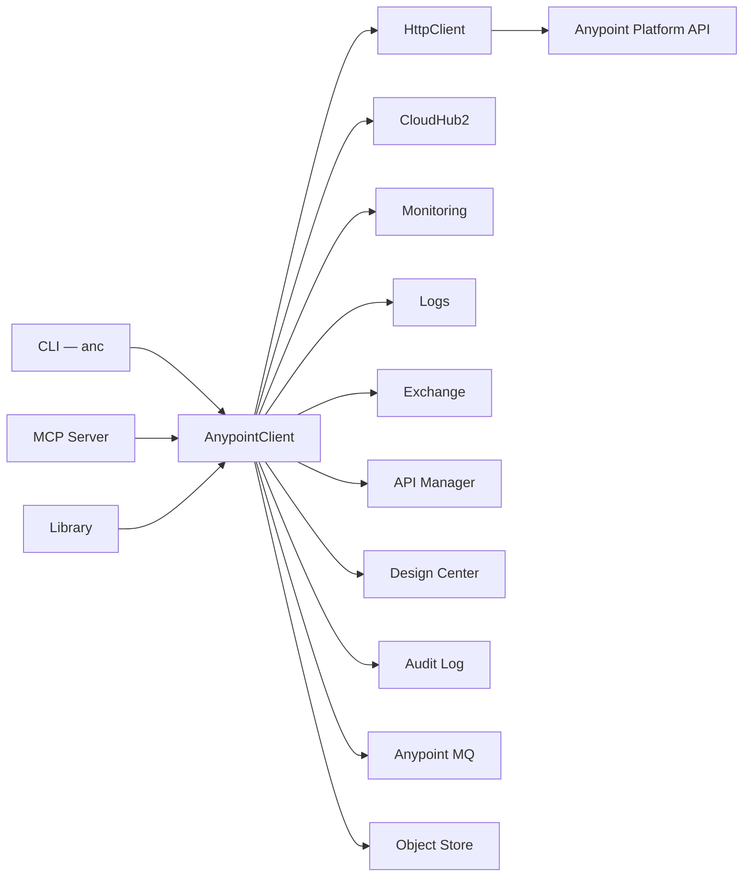

# Architecture

Three entry points — CLI, MCP server, and library — share one client facade, so a capability added once
is available to all three and behaves identically.



## Layers

| Layer | Responsibility |
| --- | --- |
| Auth | OAuth2 browser flow, AES-256-GCM encrypted token storage, automatic refresh with a five-minute buffer |
| Client | `AnypointClient` facade, Axios HTTP client with bearer injection, token-bucket rate limiting, TTL cache with observability |
| API | One client per platform domain: CloudHub 2.0, Logs, Monitoring, Exchange, API Manager, Design Center, Audit Log, Anypoint MQ, Object Store, Access Management |
| Analysis | Log pipeline: multi-line joining, JSON logger parsing, error grouping, context windows, pattern detection, statistics |
| Safety | Environment classification, JAR validation, confirmation gates |
| Surfaces | `anc` CLI, stdio MCP server, library barrel export |

Rate limiting and caching live below the facade, so every surface inherits them. A burst of agent tool
calls is throttled the same way a scripted loop is.

??? note "Source tree"

    ```text
    src/
    ├── auth/              OAuth2 + encrypted token storage
    │   ├── OAuthFlow.ts         Browser callback at /api/callback
    │   ├── TokenManager.ts      Auto-refresh with 5-min buffer
    │   ├── FileStore.ts         AES-256-GCM encrypted tokens
    │   └── TokenStore.ts        Storage interface
    ├── client/            HTTP + facade
    │   ├── AnypointClient.ts    Main facade (single entry point)
    │   ├── HttpClient.ts        Axios with Bearer injection
    │   ├── RateLimiter.ts       Token bucket throttling
    │   └── Cache.ts             TTL in-memory cache with observability
    ├── api/               Domain API clients
    │   ├── CloudHub2Api.ts      Deploy, redeploy, restart, scale, poll
    │   ├── LogsApi.ts           Tail, download (CH2 native)
    │   ├── MonitoringApi.ts     AMQL queries, JSON/CSV export
    │   ├── ExchangeApi.ts       Search assets, download specs, publish
    │   ├── ApiManagerApi.ts     API instances, policies, SLA tiers
    │   ├── DesignCenterApi.ts   Projects, files, lock/save, publish
    │   ├── AuditLogApi.ts       Platform audit events
    │   ├── AnypointMQApi.ts     Queue management, message browsing
    │   ├── ObjectStoreApi.ts    Object Store v2 — stores, keys, values
    │   └── AccessManagementApi.ts  User, environments, org entitlements
    ├── analysis/          Log analysis pipeline
    │   ├── LogAnalyzer.ts       Pipeline orchestrator
    │   ├── parser.ts            Multi-line joiner + JSON Logger parser
    │   ├── error-context.ts     Error context windows
    │   ├── error-grouper.ts     Clusters similar errors
    │   ├── pattern-detector.ts  Recurring message templates
    │   ├── stats.ts             Level distribution, error spikes
    │   └── utils.ts             Noise detection, templatization
    ├── commands/          CLI commands
    ├── safety/            Production guards
    ├── utils/config.ts    Profile-based config resolution
    ├── cli.ts             CLI entry point (bin: anc)
    ├── mcp.ts             MCP server entry point
    └── index.ts           Library barrel export
    ```

## Design notes

- **Tokens are encrypted at rest** and stored per profile, separate from credentials, so a config file can
  be inspected without exposing a session.
- **The cache is observable.** `anypoint://diagnostics/cache` reports hit rates, which matters when an
  agent's repeated questions should not become repeated platform calls.
- **Log analysis happens client-side.** Grouping, context windows, and pattern detection run locally, so
  an agent can ask for structure instead of paging through raw volume.
- **Safety lives in one place.** Environment classification and confirmation gates are a distinct layer
  rather than scattered checks, which is what lets every mutating surface behave the same way.

Deeper notes on the deployment path are in [Deploying a JAR](deployment-tools.md).
