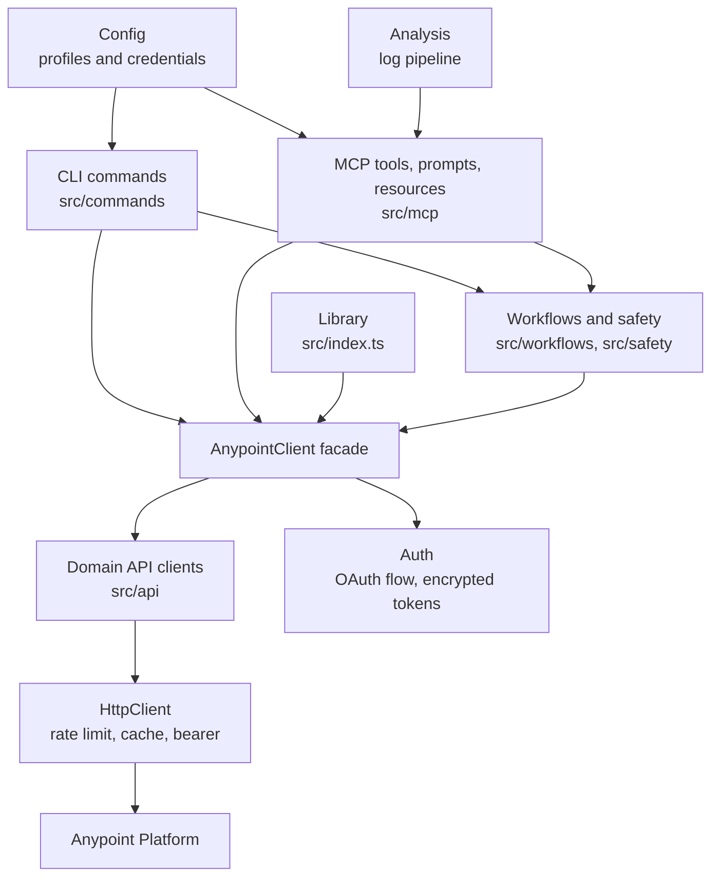

# Architecture

Three entry points (the `anc` CLI, the MCP server, and the library) share one client facade and one set
of workflows. A capability added once is available to every surface and behaves the same way in each.


```mermaid
graph TD
    CLI["CLI commands<br/>src/commands"] --> WF
    MCP["MCP tools, prompts, resources<br/>src/mcp"] --> WF
    CLI --> AC
    MCP --> AC
    LIB["Library<br/>src/index.ts"] --> AC

    WF["Workflows and safety<br/>src/workflows, src/safety"] --> AC["AnypointClient facade"]
    AC --> API["Domain API clients<br/>src/api"]
    API --> HTTP["HttpClient<br/>rate limit, cache, bearer"]
    HTTP --> AP["Anypoint Platform"]
    AC --> AUTH["Auth<br/>OAuth flow, encrypted tokens"]
    CFG["Config<br/>profiles and credentials"] --> CLI
    CFG --> MCP
    ANA["Analysis<br/>log pipeline"] --> MCP
```

## Layers

| Layer | Directory | Responsibility |
| --- | --- | --- |
| Auth | `src/auth` | State-bound OAuth 2.0 browser flow with a loopback-only callback, AES-256-GCM token storage, automatic refresh with a five-minute buffer |
| Client | `src/client` | `AnypointClient` facade, Axios HTTP client with bearer injection, token-bucket rate limiting, TTL cache with statistics |
| API | `src/api` | One client per platform domain: Access Management, CloudHub 2.0, Logs, Monitoring, Exchange, API Manager, Design Center, API Governance, Audit Log, Anypoint MQ, Object Store v2 |
| Workflows | `src/workflows` | Multi-step operations shared by CLI and MCP: JAR publication and deployment, Design Center preview and apply |
| Safety | `src/safety` | Production detection, JAR and Maven metadata inspection, SHA-256 binding, deployment payload builders, deletion previews |
| Config | `src/config` | Profile resolution (flag, `ANYPOINT_PROFILE`, project binding, default), credential resolution, legacy migration |
| Analysis | `src/analysis` | Log pipeline: multi-line joining, JSON logger parsing, error grouping, context windows, pattern detection, statistics |
| Surfaces | `src/commands`, `src/mcp`, `src/index.ts` | `anc` CLI commands, stdio MCP server, library exports |

Dependencies point downward. Commands and MCP tools resolve an environment, call a workflow or an API
client, and format the result; they do not build platform payloads themselves. Rate limiting and caching
live below the facade, so a burst of tool calls is throttled the same way a scripted loop is.

## Source tree

```text
src/
├── cli.ts                  CLI entry point (bin: anc)
├── mcp.ts                  MCP executable entry point (node dist/mcp.js)
├── index.ts                Library exports
├── version.ts              Package version
├── auth/
│   ├── OAuthFlow.ts            Browser authorization with a callback at /api/callback
│   ├── OAuthCallbackPage.ts    Self-contained callback page
│   ├── TokenManager.ts         Refresh with a five-minute buffer
│   ├── FileStore.ts            AES-256-GCM encrypted token file
│   └── TokenStore.ts           Storage interface
├── client/
│   ├── AnypointClient.ts       Facade: one property per API client, plus the Design Center workflow
│   ├── HttpClient.ts           Axios with bearer injection and multipart upload
│   ├── RateLimiter.ts          Token bucket
│   └── Cache.ts                TTL cache with hit/miss statistics
├── api/
│   ├── AccessManagementApi.ts  Identity, environments, entitlements
│   ├── CloudHub2Api.ts         Deployments, artifact-ref updates, scale, restart, history, delete
│   ├── LogsApi.ts              Tail and download
│   ├── MonitoringApi.ts        AMQL search, traffic, runtime, and time-series metrics
│   ├── ExchangeApi.ts          Search, asset details, spec download, JAR publication
│   ├── ApiManagerApi.ts        API instances, policies, SLA tiers, alerts
│   ├── DesignCenterApi.ts      Projects, branches, files, locks, saves, publication
│   ├── GovernanceApi.ts        Rulesets and conformance
│   ├── AuditLogApi.ts          Platform audit events
│   ├── AnypointMQApi.ts        Destinations, statistics, dead-letter browsing, publish
│   └── ObjectStoreApi.ts       Stores, keys, values
├── workflows/
│   ├── jar-deployment.ts       Plan, describe, and execute publish + deploy (anc deploy, deploy_jar)
│   └── design-center.ts        Token-bound preview and apply for create, sync, and publish
├── safety/
│   ├── guards.ts               Production detection, deploy summary, JAR file checks, typed confirmation
│   ├── artifact.ts             Maven metadata inspection and SHA-256 verification
│   ├── deployment.ts           Create payload, artifact-only merge, rollback target, settings merge
│   └── deletion.ts             Deletion preview and deployment-ID binding
├── config/
│   └── profiles.ts             Profiles, project binding, credential resolution
├── analysis/
│   ├── LogAnalyzer.ts          Pipeline orchestrator
│   ├── parser.ts               Multi-line joiner and JSON logger parser
│   ├── error-context.ts        Context windows around errors
│   ├── error-grouper.ts        Clusters similar errors
│   ├── pattern-detector.ts     Recurring message templates
│   ├── stats.ts                Level distribution and error spikes
│   ├── normalize.ts            Noise detection and templating helpers
│   └── types.ts                Shared types
├── commands/               One module per CLI command group (config, auth, apps, deploy, logs,
│                           monitor, exchange, api, design-center) plus shared helpers
├── mcp/
│   ├── server.ts               Server class: builds the client and registers everything
│   ├── prompts.ts              Workflow prompts
│   ├── resources.ts            anypoint:// resources
│   └── tools/                  One registrar per domain: identity, profile, apps-read,
│                               apps-lifecycle, apps-deploy, logs, analysis, monitoring, exchange,
│                               api-manager, design-center, governance, audit, anypoint-mq,
│                               object-store, plus shared helpers
└── utils/                  Errors (including AmqlQueryError), date parsing, formatting, logging
```

The [tool catalog](tools.md) is generated from the registrars in `src/mcp/tools`, so it always lists
exactly what the server registers.

## Safety model in brief

- **Application deployments preview by default.** MCP deployment tools change nothing without
  `confirm: true`; `anc deploy` supports `--dry-run` and asks for a typed phrase in production.
- **Redeploys change only the artifact reference.** Runtime, target, replicas, vCores, and settings are
  preserved, and create-only settings are rejected for existing apps.
- **Artifacts are bound to their bytes.** Coordinates come from the JAR's embedded Maven metadata, and
  the SHA-256 shown in the preview can be required at publication.
- **Deletion is bound to a deployment ID**, with a separate production acknowledgement.
- **Design Center writes are token-bound.** A preview issues a single-use, ten-minute token tied to the
  exact inputs and hashes; apply rechecks under a lock and verifies what was saved or published.

Which operations are applied on call is listed in the [safety model](safety.md).

## Design notes

- **Tokens are encrypted at rest** and stored per profile, separate from credentials, so a config file can
  be inspected without exposing a session.
- **OAuth callbacks fail closed.** The authorization URL creates a single-use state value, the local
  callback accepts only the configured loopback path and matching state, and every HTML response escapes
  provider text and disables caching and cross-origin loading.
- **Metrics errors are never empty results.** Monitoring queries raise `AmqlQueryError` with the
  platform's message, string literals are escaped, organization and environment IDs are validated, and
  cumulative GC counters are converted to deltas. See [Monitoring](monitoring.md).
- **The cache is observable.** `anypoint://diagnostics/cache` reports hit rates, which matters when
  repeated questions should not become repeated platform calls.
- **Log analysis happens client-side.** Grouping, context windows, and pattern detection run locally, so
  a caller can ask for structure instead of paging through raw volume.
- **Workflows are shared, not duplicated.** `anc deploy` and `deploy_jar` call the same JAR workflow;
  `anc dc push`/`publish` and the Design Center MCP tools call the same preview and apply workflow.
