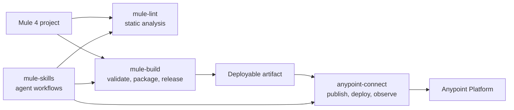

# Ecosystem

`anypoint-connect` is one of four MuleSoft tools that work together. Each is independent — use one, or all
of them.

| Project | Role | Credentials | Documentation |
| --- | --- | --- | --- |
| [`anypoint-connect`](https://github.com/Avinava/anypoint-connect) | Authorized Anypoint Platform evidence and lifecycle operations | Anypoint login | this site |
| [`mule-build`](https://github.com/Avinava/mule-build) | Validate, test, package, run locally, and release a Mule application | None | [mule-build docs](https://avinava.github.io/mule-build/) |
| [`mule-lint`](https://github.com/Avinava/mule-lint) | Static analysis of Mule XML, DataWeave, YAML, and project structure | None | [mule-lint docs](https://avinava.github.io/mule-lint/) |
| [`mule-skills`](https://github.com/Avinava/mule-skills) | Agent workflows for documentation, development, troubleshooting, operations, review, and build | None | [mule-skills docs](https://avinava.github.io/mule-skills/) |

## Where the boundaries are

This is the only one that authenticates. `mule-lint` and `mule-build` work entirely on local source: they
lint, validate, test, package, and version. The moment an artifact needs to reach Anypoint Platform, or a
question needs runtime evidence, it becomes this tool's job.

A complete release therefore crosses two tools: `mule-build release` produces and versions the artifact,
then `deploy_jar` or `publish_app_jar` plus `update_app_artifact` puts it in an environment. Keeping the
credentialed step separate is deliberate — a build should not need platform access, and most builds do not.

## Through mule-skills

[`mule-skills`](https://avinava.github.io/mule-skills/) ships this server preconfigured with a pinned
version and adds the judgment layer on top of it:

| Skill | Uses this tool for |
| --- | --- |
| `mule-ops` | Runtime health: logs, error grouping, metrics, memory, deployment history |
| `mule-troubleshooting` | Incident telemetry correlated with source and configuration |
| `mule-review` | Optional runtime verification of a finding |
| `mule-build` | Only for an authorized publish or deploy |

Those workflows also gate on access before their first call and offer alternatives when it is missing, so
an unauthenticated setup produces a labeled coverage gap instead of a failed session. That gate uses the
same state names as [Access readiness](readiness.md).
