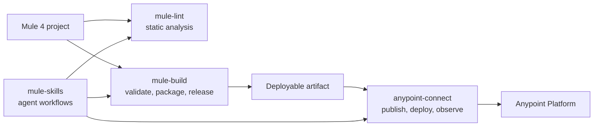

# Ecosystem

`anypoint-connect` is independently versioned. The canonical package matrix, supported combination,
credentials, and end-to-end setup live in the
[mule-skills ecosystem hub](https://avinava.github.io/mule-skills/ecosystem/).

This page documents only the `anypoint-connect` boundary so the compatibility table is not copied
across repositories.

## Where the boundaries are

This is the only one that authenticates. `mule-lint` and `mule-build` work entirely on local source: they
lint, validate, test, package, and version. The moment an artifact needs to reach Anypoint Platform, or a
question needs runtime evidence, it becomes this tool's job.

```mermaid
flowchart LR
    Source["Mule 4 project"] --> Lint["mule-lint<br/>static analysis"]
    Source --> Build["mule-build<br/>validate, package, release"]
    Build --> Artifact["Deployable artifact"]
    Artifact --> Connect["anypoint-connect<br/>publish, deploy, observe"]
    Connect --> Platform["Anypoint Platform"]
    Skills["mule-skills<br/>agent workflows"] --> Lint
    Skills --> Build
    Skills --> Connect
```

A complete release therefore crosses two tools: `mule-build release` produces and versions the artifact,
then `deploy_jar` or `publish_app_jar` plus `update_app_artifact` puts it in an environment. Keeping the
credentialed step separate is deliberate — a build should not need platform access, and most builds do not.

## Through mule-skills

[`mule-skills`](https://avinava.github.io/mule-skills/) ships this server preconfigured with a pinned
version and adds the judgment layer on top of it:

| Skill | Uses this tool for |
| --- | --- |
| `mule-ops` | Runtime health: logs, error grouping, metrics, memory, deployment history |
| `mule-troubleshooting` | Incident telemetry correlated with source and configuration |
| `mule-review` | Optional runtime verification of a finding |
| `mule-build` | Only for an authorized publish or deploy |

Those workflows also gate on access before their first call and offer alternatives when it is missing, so
an unauthenticated setup produces a labeled coverage gap instead of a failed session. That gate uses the
same state names as [Access readiness](readiness.md).

## Verified artifact handoff

For application publication, carry `jarPath` and the build's verified `artifact` fields into
`publish_app_jar` or `deploy_jar`. Pass `artifact.artifactId` as `assetId`, `artifact.version`
as `assetVersion`, and `artifact.sha256` as `expectedSha256`. Resolve the Exchange group explicitly
when it differs from the Maven group. The publication preview shows both the embedded identity
and the chosen Exchange coordinates; explicit coordinate mappings remain supported.

Without explicit asset ID/version, these MCP tools use embedded Maven metadata. They never derive
identity from a timestamped filename or silently choose version 1.0.0. If metadata is absent,
supply both values explicitly. A preview returns `expectedSha256`; pass it back on confirmation.
A changed digest prevents upload. Preview and authentication requirements still apply, and a
successful local build alone does not authorize publication or deployment.

## Release and documentation coordination

Package releases remain explicit version-tag releases. Keep `package.json`, both lockfile root
versions, the newest versioned changelog entry, and any versioned examples in agreement. Run
`node scripts/check-release.mjs` before preparing a release; the tag workflow additionally requires
an exact `vX.Y.Z` match and passes the repository checks, dependency audit, and strict documentation
build before publishing. Changes under `Unreleased` do not update a published package automatically.

Choose the next semantic version after reviewing public contract changes. Merge the reviewed version
commit before pushing only its new tag; never move an existing release tag. The compatibility hub
keeps its existing published pins until the new package is available and its compatibility checks pass.
A missing dispatch token requires a manual hub update and does not undo a successful publication.

The documentation site follows the default branch independently of npm releases. Its Pages workflow
builds with `mkdocs build --strict`; manual publication also requires the default branch. A passing
pull-request build validates the proposed docs without publishing them. Tag publication, Pages
deployment, and a hub pin update remain separate operations.
