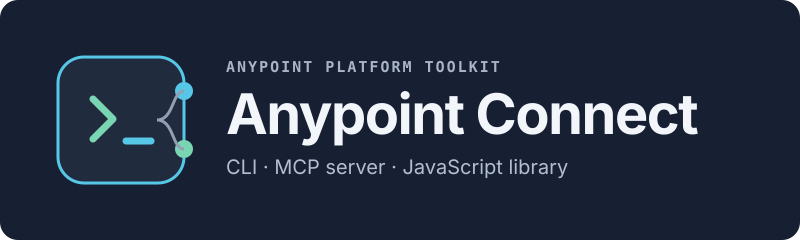

# anypoint-connect

A CLI, MCP server, and TypeScript library for Anypoint Platform: deploy applications, tail and analyze
logs, pull metrics, manage API specs, and inspect queues and Object Stores — with production safety
nets on every mutating operation.

```bash
npm install -g @sfdxy/anypoint-connect
anc config init
anc auth login
anc auth status
```

## Start here

| You want to | Go to |
| --- | --- |
| Set it up from scratch, including the Connected App | [Getting started](getting-started.md) |
| Work across several organizations | [Profiles and multiple orgs](profiles.md) |
| Understand what happens when access is missing | [Access readiness](readiness.md) |
| Look up a command | [CLI reference](cli-reference.md) |
| Let an AI agent use it | [MCP server](mcp.md) |
| Find the right tool | [Tool catalog](tools.md) |
| Know what can and cannot mutate production | [Safety model](safety.md) |
| Ship a locally built JAR | [Deploying a JAR](deployment-tools.md) |
| Fix something | [Troubleshooting](troubleshooting.md) |

## What it covers

| Area | Examples |
| --- | --- |
| Applications | Status, deployment spec, resources, settings, deploy, redeploy, rollback, restart, scale, stop, start, delete |
| Logs | Tail, download, error clustering with context windows, recurring patterns, statistical health |
| Monitoring | Request and response metrics, percentiles, time series, per-replica, JVM memory and GC, freeform AMQL |
| Exchange | Search, asset detail, spec download, JAR publication |
| API Manager | Instances, policies, SLA tiers, alerts |
| Design Center | Projects, files, read, update, publish |
| Platform | Environments, entitlements, audit log |
| Anypoint MQ | Queues, depth and throughput, dead-letter browsing, test publishing |
| Object Store v2 | Stores, keys, values |

## Safety, in one paragraph

Every mutating operation is dry-run by default: called without `confirm: true` it returns a preview of
exactly what would change and modifies nothing. Redeploying an existing application changes only the
artifact reference — runtime, target, replicas, and settings are preserved, so a redeploy cannot
silently downgrade a runtime or relocate an app. Deletion needs a deployment-ID-bound confirmation and,
in production, a separate acknowledgement, so it fails closed if the deployment changed underneath you.
The full model is on the [safety page](safety.md).

## This is the one that needs credentials

Of the four tools in this [ecosystem](ecosystem.md), only `anypoint-connect` authenticates against
Anypoint Platform. Set it up when you want runtime evidence or lifecycle operations; skip it if you only
need to lint, build, package, or document a project locally.
